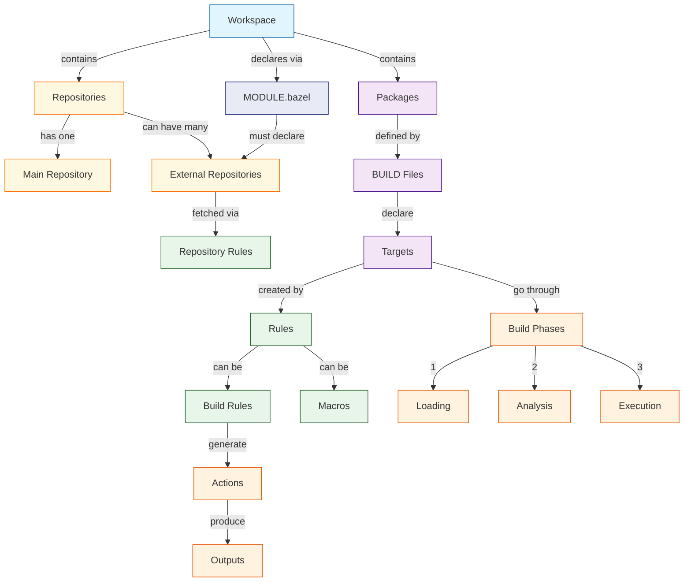

# Core Concepts in Bazel

This guide introduces the fundamental concepts in Bazel, explaining how they work together to create a powerful and efficient build system.

## Component Relationships



The diagram above illustrates how Bazel's core components interact:

1. **Workspace and Repositories**
   - Workspace: The root of your build environment
   - Main Repository: Your primary source code (exactly one)
   - External Repositories: Third-party dependencies (zero or more)
   - MODULE.bazel: Explicitly declares all repositories

2. **Rules and Targets**
   - Build Rules: Define how to build outputs from inputs
   - Macros: Reusable rule patterns and shortcuts
   - Repository Rules: Define how to fetch external code
   - Targets: Things that can be built

3. **Build Process**
   - Loading: Read BUILD files and evaluate macros
   - Analysis: Create action graph from rules
   - Execution: Run actions to create outputs

## Overview

Bazel is a build system that:
- Provides reproducible builds
- Enables incremental compilation
- Supports multiple languages
- Scales to large codebases
- Offers extensible build rules

## Key Concepts

### Repositories and MODULE.bazel

Repositories are self-contained directory trees of source code. In modern Bazel:

1. **Main Repository**
   - Your primary workspace
   - Contains your source code
   - Defined by the workspace directory
   - Contains the MODULE.bazel file

2. **External Repositories**
   - Third-party dependencies
   - Must be explicitly declared in MODULE.bazel
   - Referenced with `@repo_name`
   - Fetched during build

Example MODULE.bazel:
```python
module(
    name = "my_project",
    version = "1.0",
)

# All external repositories must be declared
bazel_dep(name = "rules_cc", version = "0.0.1")
bazel_dep(name = "protobuf", version = "3.19.0")
```

Example repository references:
```python
# Reference to main repository
//my/package:target

# Reference to external repository (must be declared in MODULE.bazel)
@com_github_example//my/package:target
```

### Workspaces

A workspace is a directory containing:
- Source files
- Symbolic links
- BUILD files
- A MODULE.bazel file (for modern Bazel)
- Build outputs in the `bazel-*` directories

### Packages

A package is a collection of related files and a `BUILD` or `BUILD.bazel` file. It:
- Is the fundamental unit of code organization
- Has a unique name based on its path
- Contains rules and targets
- Defines visibility boundaries

Example package structure:
```
src/main/java/com/example/
├── BUILD
├── Foo.java
└── Bar.java
```

### Targets

Targets are things that can be built. They are:
- Defined by rules in BUILD files
- Named using labels (e.g., `//path/to/package:target`)
- Connected through dependencies
- Subject to visibility restrictions

Example target:
```python
cc_binary(
    name = "hello",
    srcs = ["hello.cc"],
    deps = [":hello_lib"],
)
```

### Labels

Labels uniquely identify targets:
```python
//path/to/package:target_name         # Explicit target
//path/to/package                     # Package default target
:target_name                         # Target in current package
@repository//package:target          # External repository target
```

### Rules

Rules define:
- How to build outputs from inputs
- What dependencies are allowed
- How inputs should be processed
- What outputs are produced

Example rule usage:
```python
java_library(
    name = "lib",
    srcs = glob(["*.java"]),
    deps = [
        "//third_party/some_library",
        "@maven//:com_google_guava_guava",
    ],
)
```

### Actions

Actions are the basic unit of work in Bazel:
- Created by rules during analysis
- Define exact commands to run
- Specify inputs and outputs
- Are executed during the build phase

Example action (conceptual):
```python
Action(
    inputs = ["source.cc", "header.h"],
    outputs = ["source.o"],
    command = "gcc -c source.cc -o source.o",
)
```

### Dependencies

Bazel manages three distinct types of dependencies, each serving a different purpose in the build process:

1. **Ruleset Dependencies**
   - Defined in MODULE.bazel
   - Provide build rules and macros
   - Required during the loading phase
   ```python
   # MODULE.bazel
   bazel_dep(name = "rules_cc", version = "0.0.9")    # C++ build rules
   bazel_dep(name = "rules_python", version = "0.27.1")  # Python build rules
   ```

2. **Code Dependencies**
   - Can be internal or external
   - Used during compilation and linking
   - Declared in BUILD files
   ```python
   cc_binary(
       name = "app",
       srcs = ["app.cc"],
       deps = [
           "//my/project:lib",      # Internal dependency
           "@boost//:filesystem",   # External dependency
       ],
       data = ["//data:config"],   # Runtime dependency
   )
   ```

3. **Tool Dependencies**
   - Programs needed during the build
   - Used in the execution phase
   - Often generate code or process inputs
   - Can be managed through toolchains
   ```python
   # Simple tool dependency
   genrule(
       name = "generated_code",
       srcs = ["input.proto"],
       tools = ["//tools:protoc"],    # Direct tool reference
       outs = ["output.pb.cc"],
       cmd = "$(location //tools:protoc) $(SRCS) > $(OUTS)",
   )

   # Tool managed by toolchain
   cc_binary(
       name = "app",
       srcs = ["app.cc"],
       # Compiler comes from cc_toolchain
       # No explicit tool dependency needed
   )
   ```

   Tools can be specified directly or managed through Bazel's toolchain system. Toolchains provide:
   - Automatic tool selection based on platform
   - Consistent tool configuration
   - Proper tool isolation
   
   See [Configuration and Toolchains](configuration-and-toolchains.md) for more details about Bazel's sophisticated toolchain system.

Bazel processes these dependencies in a specific order:
1. Loads and analyzes ruleset dependencies
2. Checks and makes tool dependencies available
3. Processes code dependencies during the build

This separation ensures that:
- Build rules are available when needed
- Tools are ready for code generation
- Dependencies are properly ordered for compilation

## Build Phases

Bazel's build process has three main phases:

### 1. Loading Phase
- Reads BUILD files
- Evaluates build rules
- Creates target graph

### 2. Analysis Phase
- Analyzes dependencies
- Creates action graph
- Validates build configuration

### 3. Execution Phase
- Executes necessary actions
- Produces outputs
- Updates build cache

## Hermetic Builds

Bazel ensures hermeticity through:
- Explicit dependencies
- Input digests
- Sandboxed execution
- Reproducible actions

Example sandboxing:
```python
genrule(
    name = "generate",
    srcs = ["input.txt"],
    outs = ["output.txt"],
    cmd = "cat $(location :input.txt) > $(location output.txt)",
    # Executed in sandbox with only declared inputs
)
```

## Build Configuration

Configuration affects how targets are built:
- Platforms define where code runs
- Toolchains define how code is built
- Options control build behavior

Example configuration:
```python
# Command line
bazel build //my:target --cpu=arm64 --compilation_mode=opt

# Platform configuration
platform(
    name = "my_platform",
    constraint_values = [
        "@platforms//cpu:arm64",
        "@platforms//os:linux",
    ],
)
```

## Caching

Bazel uses multiple caching layers:
- Action cache (local)
- Output cache (local)
- Remote cache (optional)
- Repository cache (for external deps)

## Best Practices

1. **Package Organization**
   - Keep packages small and focused
   - Group related functionality
   - Use clear naming conventions

2. **Dependency Management**
   - Declare direct dependencies only
   - Use fine-grained targets
   - Control visibility carefully

3. **Build Configuration**
   - Use platforms and toolchains
   - Define constraints explicitly
   - Test multiple configurations

## Related Documentation

- [Working with External Dependencies](https://bazel.build/external/overview)
- [Platforms and Toolchains](https://bazel.build/concepts/platforms)
- [Visibility Rules](https://bazel.build/concepts/visibility)
- [Build Performance](https://bazel.build/configure/best-practices)
