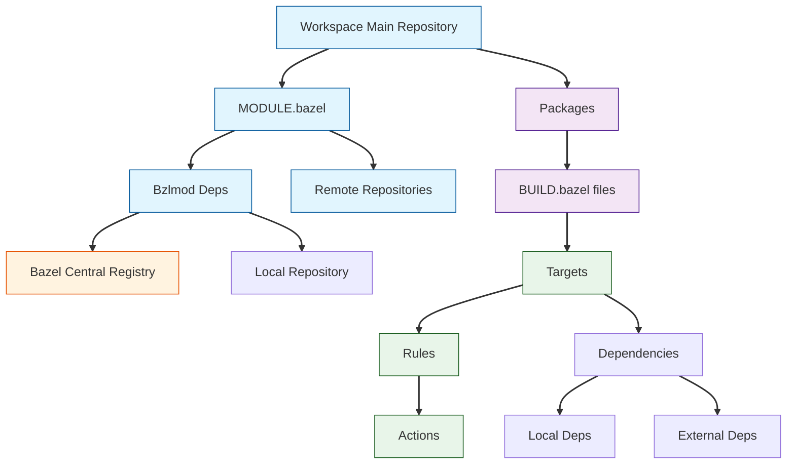

# Modern Bazel Overview

This guide introduces modern Bazel with Bzlmod, focusing on current best practices for dependency management and build configuration. Bzlmod is now the standard way to manage dependencies in Bazel, replacing the legacy WORKSPACE-based approach.

## Core Concepts Relationship



The diagram above illustrates how different components in Bazel relate to each other:

1. **Workspace Main Repository**: The root of your build environment, containing:
   - `MODULE.bazel`: Configuration file for external dependencies
   - Packages: Collections of related files and build rules

2. **MODULE.bazel Components**:
   - Bzlmod Deps: Define dependencies from Bazel Central Registry or local sources
   - Remote Repositories: Make external repositories available to your workspace

3. **Dependencies Sources**:
   - Bazel Central Registry (BCR): Official source of verified Bazel modules
   - Local Repository: Dependencies from your local filesystem

4. **Packages**: Defined by:
   - `BUILD.bazel` files: Specify build rules and targets
   - Targets: Individual buildable units that can depend on other targets

5. **Rules and Actions**:
   - Rules: Define how to build outputs from inputs
   - Actions: Concrete steps executed during build

## What is Modern Bazel?

Modern Bazel with Bzlmod provides:

1. **Module-based Dependencies**
   - Explicit version declarations
   - Central registry integration
   - Dependency visibility controls

2. **MODULE.bazel Configuration**
   - Replaces WORKSPACE files
   - Simpler dependency syntax
   - Integration with Bazel Central Registry

3. **Build Structure**
   - Package-based organization
   - Clear visibility boundaries
   - Reproducible builds

## Key Differences from Legacy Bazel

### Legacy Approach (WORKSPACE)
```python
# WORKSPACE
load("@bazel_tools//tools/build_defs/repo:http.bzl", "http_archive")

http_archive(
    name = "rules_python",
    url = "https://github.com/bazelbuild/rules_python/releases/download/0.24.0/rules_python-0.24.0.tar.gz",
    sha256 = "...",
)

load("@rules_python//python:repositories.bzl", "py_repositories")
py_repositories()
```

### Modern Approach (MODULE.bazel)
```python
# MODULE.bazel
module(
    name = "my_project",
    version = "1.0",
)

# Dependencies from Bazel Central Registry
bazel_dep(name = "rules_python", version = "0.27.1")
```

## Understanding Modern Bazel

### 1. Dependency Resolution
- Dependencies are fetched from registries
- Version conflicts are reported early
- Direct dependencies are explicitly declared

### 2. Build Reproducibility
- Specific versions are used
- Build steps are deterministic
- Toolchains are explicitly configured

### 3. Module Structure
- Each module has its own namespace
- Dependencies are scoped to modules
- Build files define package contents

## Working with Modern Bazel

### 1. Module Configuration
```python
# MODULE.bazel
module(
    name = "my_app",
    version = "0.1.0",
    compatibility_level = 1,
)

# Core build rules
bazel_dep(name = "rules_python", version = "0.27.1")
bazel_dep(name = "rules_go", version = "0.42.0")
```

### 2. Package Definition
```python
# BUILD.bazel
load("@rules_python//python:defs.bzl", "py_binary")

py_binary(
    name = "app",
    srcs = ["main.py"],
    deps = [
        "//my_lib",  # Local dependency
        "@other_module//lib",  # External dependency
    ],
)
```

## Important Considerations

1. **Module Management**
   - Use the Bazel Central Registry when possible
   - Consider private registries for internal code
   - Document registry configuration

2. **Dependency Organization**
   - Keep dependencies minimal and direct
   - Use appropriate visibility settings
   - Consider dependency impact on build times

3. **Version Selection**
   - Use specific versions from BCR
   - Test version updates thoroughly
   - Monitor for security updates

## Limitations and Workarounds

1. **Legacy Dependencies**
   - Some repositories may not support Bzlmod
   - Use `use_repo_rule` for complex setup
   - Consider maintaining local forks

2. **Custom Repository Rules**
   - May require special handling
   - Document any workarounds
   - Plan for future migration

3. **Toolchain Configuration**
   - Some tools require explicit setup
   - Platform constraints may apply
   - Test on all target platforms

## Next Steps

- Learn about [Labels and Targets](/concepts/labels-and-targets)
- Understand [Packages and Visibility](/concepts/packages-and-visibility)
- Explore [Dependencies and Actions](/concepts/dependencies-and-actions)
- Read about the [Bazel Central Registry](/concepts/bazel-central-registry)
