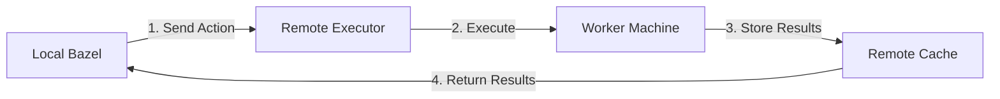

# Remote Execution

This guide explains how Bazel can execute build actions on remote machines. Remote execution helps scale your builds across multiple machines and ensures consistent build environments.

## Core Concepts

### What is Remote Execution?

Instead of running build actions locally, Bazel can:
- Execute actions on remote machines
- Cache results for reuse
- Distribute work across many machines
- Ensure consistent execution environments

### Components

1. **Remote Executor**
   - Runs build actions
   - Manages execution environment
   - Reports results back to Bazel

2. **Remote Cache**
   - Stores build outputs
   - Shares results between builds
   - Reduces duplicate work

3. **Content-Addressable Storage (CAS)**
   - Stores input files
   - Stores output files
   - Ensures content integrity

## How Remote Execution Works

### 1. Action Execution Flow



### 2. Configuration

```python
# .bazelrc
# Basic remote execution setup
build --remote_executor=grpc://remote.build.example.com
build --remote_cache=grpc://cache.build.example.com

# Optional: Remote instance name
build --remote_instance_name=projects/my-project/instances/default

# Optional: Remote header for authentication
build --remote_header=Authorization=Bearer $(cat ~/.remote_build_token)
```

### 3. Platform Requirements

```python
# Define execution platform requirements
platform(
    name = "remote_platform",
    constraint_values = [
        "@platforms//os:linux",
        "@platforms//cpu:x86_64",
        "//constraints:docker",  # Custom constraint
    ],
)

# Use platform for specific targets
cc_binary(
    name = "app",
    srcs = ["app.cc"],
    target_compatible_with = [
        "@platforms//os:linux",
    ],
)
```

## Remote Execution Features

### 1. Dynamic Scheduling

Bazel automatically:
- Determines which actions can run remotely
- Balances load across available workers
- Handles failures and retries

```python
# Some actions run locally, others remotely
build --spawn_strategy=remote,local
build --remote_local_fallback  # Use local execution if remote fails
```

### 2. Caching Behavior

Control what gets cached:

```python
# Cache all successful actions
build --remote_accept_cached=true

# Cache even failed actions (useful for debugging)
build --remote_accept_cached=true
build --remote_cache_failed_actions

# Don't cache certain actions
genrule(
    name = "generate",
    srcs = ["input.txt"],
    outs = ["output.txt"],
    cmd = "date > $(OUTS)",
    tags = ["no-cache"],  # Don't cache this action
)
```

### 3. Toolchain Integration

Remote execution works with Bazel's toolchain system:

```python
# Toolchain for remote execution
toolchain(
    name = "remote_cpp_toolchain",
    exec_compatible_with = [
        "@platforms//os:linux",
        "@platforms//cpu:x86_64",
    ],
    target_compatible_with = [
        "@platforms//os:linux",
        "@platforms//cpu:x86_64",
    ],
    toolchain = ":cc_toolchain",
    toolchain_type = "@bazel_tools//tools/cpp:toolchain_type",
)
```

## Best Practices

### 1. Action Design

Design actions to work well with remote execution:

```python
# Good: Hermetic action
genrule(
    name = "good_generate",
    srcs = ["input.txt"],
    outs = ["output.txt"],
    cmd = "$(location //tools:processor) $(SRCS) > $(OUTS)",
    tools = ["//tools:processor"],  # Explicit tool dependency
)

# Bad: Non-hermetic action
genrule(
    name = "bad_generate",
    outs = ["output.txt"],
    cmd = "curl https://example.com > $(OUTS)",  # Network dependency!
)
```

### 2. Resource Management

Specify resource requirements:

```python
# Indicate resource needs
genrule(
    name = "resource_heavy",
    srcs = ["large_input.txt"],
    outs = ["output.txt"],
    cmd = "$(location //tools:processor) $(SRCS) > $(OUTS)",
    tools = ["//tools:processor"],
    tags = [
        "cpu:8",        # Needs 8 CPU cores
        "memory:high",  # Needs lots of memory
    ],
)
```

### 3. Error Handling

Handle remote execution failures gracefully:

```python
# .bazelrc
# Retry failed actions
build --remote_retries=3

# Fall back to local execution
build --remote_local_fallback

# Keep going even if some targets fail
build --keep_going
```

## Common Issues and Solutions

### 1. Network Problems

```bash
# Problem: Slow uploads
ERROR: Failed to upload to remote cache: Deadline exceeded

# Solution: Adjust timeouts
build --remote_timeout=3600  # Longer timeout
```

### 2. Cache Misses

```bash
# Problem: Unexpected cache misses
INFO: Not found in remote cache

# Solution: Check action hermiticity
build --explain=explain.log  # See why cache misses occur
build --verbose_explanations
```

### 3. Platform Mismatches

```bash
# Problem: Action fails on remote executor
ERROR: Action failed to execute: Platform requirements not met

# Solution: Ensure platform compatibility
build --remote_executor_platform=//platforms:remote_platform
```

## Remote Execution Services

Bazel supports various remote execution services:

1. **Buildbarn**
   - Open-source remote execution service
   - Scalable and maintainable
   - Supports dynamic workers

2. **BuildGrid**
   - Another open-source implementation
   - Focus on security
   - Good integration with CI systems

3. **Google Cloud Build**
   - Managed service
   - Integrated with Google Cloud
   - Automatic scaling

## Related Documentation

- [Remote Execution Overview](https://bazel.build/remote/rbe)
- [Remote Caching](https://bazel.build/remote/caching)
- [Platforms and Toolchains](https://bazel.build/concepts/platforms)
- [Authentication](https://bazel.build/remote/auth)

## Next Steps

- Learn about [Rules and Evaluation](rules-and-evaluation.md) to understand how to create custom rules
- Explore [Providers and Aspects](providers-and-aspects.md) for advanced build analysis
- Read about the [Bazel Central Registry](bazel-central-registry.md) for module management

Or return to the [Concepts Overview](index.md) to explore other topics.
