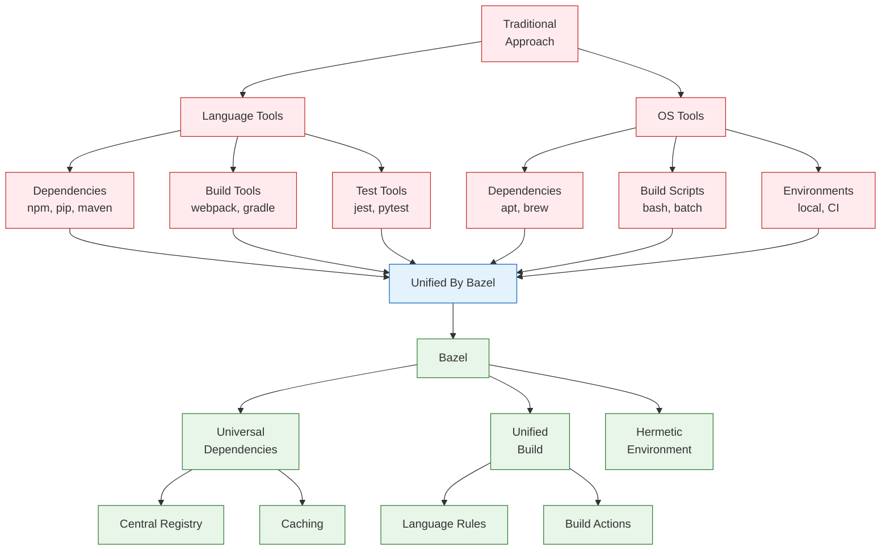

# Getting Started with Modern Bazel

Let's start by understanding what makes Bazel different from traditional build systems.



## Why Bazel?

Traditional build systems typically require:

1. **Language-Specific Solutions**:
   - Different dependency managers (npm, pip, maven)
   - Different build tools (webpack, setuptools, gradle)
   - Different test runners
   
2. **OS-Specific Configuration**:
   - Different package managers (apt, yum, brew)
   - Different environment setup
   - Different build commands

This leads to:
- Inconsistent builds across environments
- Complex setup instructions
- Dependency version conflicts
- Non-reproducible builds

Bazel solves these problems with a unified approach:

1. **Universal Dependency Management**:
   - Language-agnostic module system
   - Centralized registry for verified modules
   - Local and remote caching
   
2. **Unified Build System**:
   - Language-specific rules but unified execution
   - Cached, incremental builds
   - Parallel execution
   
3. **Hermetic Build Environment**:
   - Reproducible builds across machines
   - Explicit toolchain management
   - Controlled build inputs

## Getting Started

### Installing Bazel with Bazelisk

The recommended way to install and manage Bazel is through Bazelisk, a version manager that automatically downloads and runs the correct version of Bazel for your project.

Prerequisites:
- A supported operating system (Linux, macOS, or Windows)
- One of:
  - npm (recommended)
  - Go
  - Homebrew (macOS)
  - Chocolatey (Windows)

Install Bazelisk using your preferred package manager:
```bash
# Using npm (recommended)
npm install -g @bazel/bazelisk

# Or using Go
go install github.com/bazelbuild/bazelisk@latest
```

Bazelisk will:
- Download the correct version of Bazel based on your project's `.bazelversion` file
- Keep your Bazel installation up to date
- Switch between different versions for different projects

### Create Your First Project

1. Create a new directory and initialize it:
```bash
mkdir my-project && cd my-project
echo "7.4.0" > .bazelversion  # Pin Bazel version
```

2. Create `MODULE.bazel`:
```python
module(
    name = "my_project",
    version = "0.1.0",
)

bazel_dep(name = "rules_python", version = "0.27.1")
```

3. Create a simple Python application:

::: code-group
```python [main.py]
def main():
    print("Hello from Modern Bazel!")

if __name__ == "__main__":
    main()
```

```python [BUILD.bazel]
load("@rules_python//python:defs.bzl", "py_binary")

py_binary(
    name = "hello",
    srcs = ["main.py"],
)
```
:::

4. Build and run:
```bash
bazel run //:hello
```

## Project Structure

A typical Bazel project structure:

```
my_project/
├── .bazelversion        # Pinned Bazel version
├── MODULE.bazel         # Module and dependency definitions
├── BUILD.bazel          # Build targets for the root package
├── main.py             # Source code
└── src/                # Additional source directories
    └── BUILD.bazel     # Build targets for src package
```

## Next Steps

- Learn about [Build Rules](./build-rules) and how they work
- Understand [Module Dependencies](./module-dependencies)
- Explore the [Core Concepts](/concepts/core-concepts)

## Common Issues

1. **Version Conflicts**
   - Use compatible versions from the [Bazel Central Registry](https://registry.bazel.build)
   - Check dependency documentation for version requirements

2. **Build Failures**
   - Verify rule usage in `BUILD.bazel` files
   - Check that all required dependencies are declared
   - Run `bazel clean` if you suspect cache issues

3. **Module Not Found**
   - Verify dependency versions exist in BCR
   - Check for typos in module names
