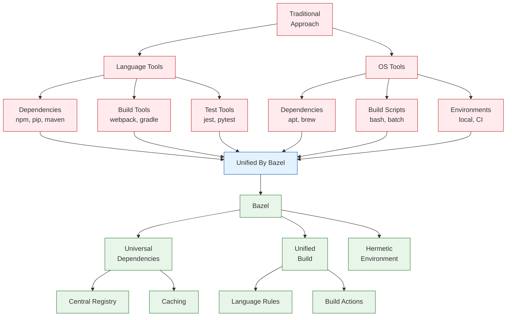

# Getting Started with Modern Bazel

Let's start by understanding what makes Bazel different from traditional build systems.



## Why Bazel?

Traditional build systems typically require:

1. **Language-Specific Solutions**:
   - Different dependency managers (npm, pip, maven)
   - Different build tools (webpack, setuptools, gradle)
   - Different test runners
   
2. **OS-Specific Configuration**:
   - Different package managers (apt, yum, brew)
   - Different environment setup
   - Different build commands

This leads to:
- Inconsistent builds across environments
- Complex setup instructions
- Dependency version conflicts
- Non-reproducible builds

Bazel solves these problems with a unified approach:

1. **Universal Dependency Management**:
   - Language-agnostic module system
   - Centralized registry for verified modules
   - Local and remote caching
   
2. **Unified Build System**:
   - Language-specific rules but unified execution
   - Cached, incremental builds
   - Parallel execution
   
3. **Hermetic Build Environment**:
   - Reproducible builds across machines
   - Explicit toolchain management
   - Controlled build inputs

## Getting Started

Now that we understand why Bazel is valuable, let's set it up.

### Prerequisites

- A supported operating system (Linux, macOS, or Windows)
- Python 3.7 or later (for Python examples)
- Git (recommended)

## Installation

Install Bazel on your system:

::: code-group
```bash [Linux]
# For Ubuntu/Debian
sudo apt install curl gnupg
curl -fsSL https://bazel.build/bazel-release.pub.gpg | gpg --dearmor > bazel.gpg
sudo mv bazel.gpg /etc/apt/trusted.gpg.d/
echo "deb [arch=amd64] https://storage.googleapis.com/bazel-apt stable jdk1.8" | sudo tee /etc/apt/sources.list.d/bazel.list
sudo apt update && sudo apt install bazel

# Verify installation
bazel --version
```

```bash [macOS]
# Using Homebrew
brew install bazel

# Verify installation
bazel --version
```

```powershell [Windows]
# Using Chocolatey
choco install bazel

# Verify installation
bazel --version
```
:::

Configure Bazel:
```bash
# Create user-wide Bazel configuration
touch ~/.bazelrc

# Enable Bzlmod (required for Bazel 6.x, default in 7.x)
echo 'common --enable_bzlmod' >> ~/.bazelrc
```

## Creating a New Project

Create a new directory for your project:

```bash
mkdir my-project
cd my-project
```

### Initialize Your Module

Create a `MODULE.bazel` file:

```python
module(
    name = "my_project",
    version = "0.1.0",
)

# Use a recent version from BCR
bazel_dep(name = "rules_python", version = "0.27.1")
```

### Create Your First Build Target

Create a simple Python application:

::: code-group
```python [main.py]
def main():
    print("Hello from Modern Bazel!")

if __name__ == "__main__":
    main()
```

```python [BUILD.bazel]
load("@rules_python//python:defs.bzl", "py_binary")

py_binary(
    name = "hello",
    srcs = ["main.py"],
    # Public visibility is often not needed
    # Consider restricting to specific packages
    visibility = ["//visibility:public"],
)
```
:::

Let's examine each component:

- `MODULE.bazel`: Defines your project and its dependencies
  - `name`: Your module's name (lowercase with underscores)
  - `version`: Your module's version (optional for local development)
  - `bazel_dep`: Dependencies from the Bazel Central Registry

- `BUILD.bazel`: Defines build targets
  - `load`: Imports rule definitions
  - `py_binary`: Rule for building Python executables
  - `visibility`: Access control for the target

## Building and Running

Build and run your application:

```bash
# Build the target
bazel build //:hello

# Run the binary
bazel run //:hello

# Clean build artifacts
bazel clean
```

## Project Structure

A typical Bazel project structure:

```
my_project/
├── MODULE.bazel          # Module and dependency definitions
├── .bazelrc             # Project-specific Bazel settings (optional)
├── BUILD.bazel          # Build targets for the root package
├── main.py             # Source code
└── src/                # Additional source directories
    └── BUILD.bazel     # Build targets for src package
```

## Next Steps

- Learn about [Build Rules](./build-rules) and how they work
- Understand [Module Dependencies](./module-dependencies)
- Explore the [Core Concepts](/concepts/core-concepts)

## Common Issues

1. **Version Conflicts**
   - Use compatible versions from the [Bazel Central Registry](https://registry.bazel.build)
   - Check dependency documentation for version requirements

2. **Build Failures**
   - Verify rule usage in `BUILD.bazel` files
   - Check that all required dependencies are declared
   - Run `bazel clean` if you suspect cache issues

3. **Module Not Found**
   - Ensure `--enable_bzlmod` is set
   - Verify dependency versions exist in BCR
   - Check for typos in module names
